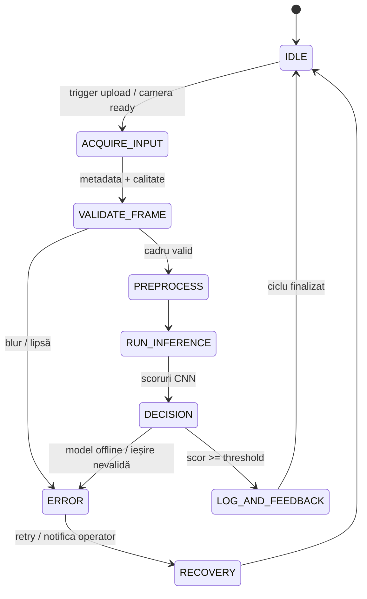

# 📘 README – P3: Proiect SAF - Diagram State Machines

**Disciplina:** Retele Neuronale
**Instituție:** POLITEHNICA București – FIIR
**Student:** Burlacu George-Florian
**Data:** 04.12.2025
**Proiect:** Recunoașterea fructelor și legumelor în timp real

---

## Scopul Etapei P3

Etapa P3 reprezintă livrarea scheletului funcțional al sistemului ciber-fizic dezvoltat în cadrul proiectului SAF. Pentru linia demonstrativă de recunoaștere a fructelor și legumelor, obiectivul este să conectăm capabilitățile de achiziție imagine (upload + cameră live), preprocesare, inferență CNN și interfața operator într-un flux coerent, astfel încât oricând să putem demonstra „cap la cap” identificarea produsului cu metrici măsurabile (latență, acuratețe, trasabilitate).

---

## Livrabile Obligatorii

### 1. Tabelul Nevoie Reală → Soluție CPS → Modul Software

| **Nevoie reală concretă**                                                                                                                              | **Cum o rezolvă SIA-ul nostru**                                                                                                                                                     | **Modul software responsabil**                                                                                                                                                              |
| -------------------------------------------------------------------------------------------------------------------------------------------------------------- | ------------------------------------------------------------------------------------------------------------------------------------------------------------------------------------------ | ------------------------------------------------------------------------------------------------------------------------------------------------------------------------------------------------- |
| Sortare automată a 36 de tipuri de fructe/legume la capătul benzii, cu decizie în < 1,2 s și acuratețe top-1 ≥ 94%                                       | Stație vizuală cu cameră RGB + server Flask. Fiecare cadru este normalizat, trimis către CNN și raportăm în UI eticheta + probabilitatea pentru a comanda ramura corectă a benzii. | Pipeline upload/cameră (`templates/index.html` + `static/styles.css`), preprocesare `src/preprocessing/preprocessing.py`, inferență CNN din `app.py` + `src/neural_network/model.py` |
| Operatorii trebuie să primească confirmare vizuală live (previzualizare + scoruri) pentru a evita greșelile de sortare și pentru a reacționa în < 0,5 s | Interfață web responsivă cu feed video oglindit, captură on-demand și listă dinamică de probabilități. UI afișează snapshot-ul și cele mai probabile trei clase.               | Modul UX (Bootstrap + vanilla JS) în `templates/index.html`, endpoint `POST /api/predict`, componenta de streaming cameră din browser + validări în `app.py`                            |
| Pregătirea datelor brute consumă timp (manual resize/rename). Necesităm să aducem 180+ imagini/clasă într-un format uniform în sub 10 minute/lot.       | Script dedicat care extrage clasele, aplică augmentări, normalizează la 128×128 RGB și sparge dataset-ul în train/val/test cu rapoarte automate.                                     | `src/preprocessing/preprocessing.py`, fișiere de configurare din `config/`, rapoarte EDA în `docs/datasets/README.md`                                                                     |

### 2. Diagrama State Machine a Întregului Sistem

Pentru trasabilitate textuală, diagrama este definită în format Mermaid (folosit pentru exportul SVG):

#### Justificarea State Machine-ului ales

Am adoptat o arhitectură de **clasificare la senzor** pentru că linia noastră de sortare trebuie să preia atât imagini încărcate de operatori, cât și cadre surprinse live, să le curețe identic și să decidă rapid clasa produsului. Fluxul este ciclic (IDLE → LOG_AND_FEEDBACK → IDLE) deoarece linia procesează loturi succesive fără oprire.

Stările principale sunt:

1. `IDLE` – sistemul așteaptă fie un fișier încărcat, fie confirmarea că feed-ul camerei este inițializat (web UI + API heartbeat < 100 ms).
2. `ACQUIRE_INPUT` – captura efectivă a imaginii (upload / snapshot) și atașarea metadatelor (ora, operator, clasă așteptată dacă e test).
3. `VALIDATE_FRAME` – verificăm rezoluția, raportul de aspect, nivelul de blur și dimensiunea fișierului. Cadrele care nu trec merg în `ERROR`.
4. `PREPROCESS` – redimensionare la 224×224, conversie RGB, normalizare și eventual augmentare (rotiri ±20°, jitter culoare) identică cu cea din antrenare.
5. `RUN_INFERENCE` – rulăm CNN-ul PyTorch încărcat în memorie și obținem vectorul de probabilități (latență țintă < 200 ms pe CPU desktop).
6. `DECISION` – aplicăm regula de afaceri (threshold 0.6 + top-3). Dacă nu există scor suficient sau modelul raportează NaN, mergem pe ramura `ERROR`.
7. `LOG_AND_FEEDBACK` – salvăm verdictul în jurnal (CSV + event log) și actualizăm UI-ul (previzualizare + bare de progres). Ulterior revenim în `IDLE` pentru cadrul următor.
8. `ERROR / RECOVERY` – tratează timp de execuție > 2 s, lipsa conexiunii la cameră sau fișiere corupte. Se face retry (max 2) și se notifică operatorul; dacă operațiunea reușește, reintrăm în `IDLE`.

Tranziții critice:

- `IDLE → ACQUIRE_INPUT` se întâmplă doar când operatorul apasă „Pornește camera” sau selectează un fișier, pentru a evita rulările în gol.
- `VALIDATE_FRAME → PREPROCESS` se produce numai dacă trecem toate filtrele de calitate; altfel `VALIDATE_FRAME → ERROR` generează mesaj pentru operator.
- `DECISION → LOG_AND_FEEDBACK` se întâmplă când `max(prob)` ≥ 0.6; în caz contrar mergem în `ERROR` și cerem un nou cadru.
- `ERROR → RECOVERY` notifică operatorul, golește buffer-ul camerei și încearcă reconectarea/recaptura.

Starea `ERROR` este esențială deoarece în mediul industrial camera poate pierde focus, lumina se poate schimba brusc sau serverul poate fi suprasolicitat. Gestionăm aceste evenimente fără a bloca fluxul principal, logăm incidentul și oferim operatorului instrucțiuni clare.

Bucla de feedback funcționează astfel: rezultatul inferenței actualizează atât UI-ul, cât și jurnalul de producție. Operatorul vede instant probabilitățile și poate accepta/respinse decizia; totodată log-urile pot fi analizate offline pentru recalibrare și retraining.

---

## Checklist Final – Bifați Totul Înainte de Predare

### Documentație și Structură

- [X] Tabelul Nevoie → Soluție → Modul complet (secțiunea 1 din acest document)
- [X] Diagrama State Machine creată și salvată (`docs/datasets/fav_state_machine.svg`) și atașată la predare
- [X] Legendă și justificare State Machine (secțiunea „Justificarea State Machine-ului ales”)

### Artefacte tehnice validate pentru P3

- [X] Script de preprocesare rulat pe subsetul de 180 imagini/clasă (`src/preprocessing/preprocessing.py`)
- [X] Model CNN de bază antrenat și salvat în `models/fruitveg_cnn.pt`
- [X] API Flask (`app.py`) care răspunde la `/predict` și `/api/predict`
- [X] Interfață web cu upload + cameră live (mirror preview)
