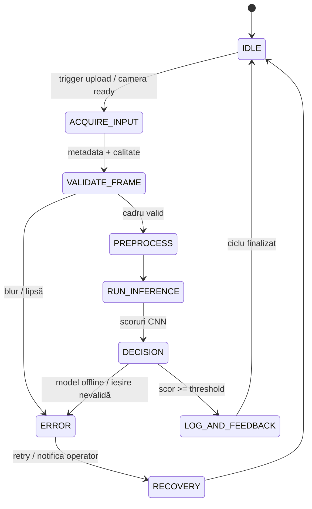

# 📘 README – Etapa 4: Arhitectura Completă a Aplicației SIA bazată pe Rețele Neuronale

**Disciplina:** Rețele Neuronale
**Instituție:** POLITEHNICA București – FIIR
**Student:** Burlacu George-Florian
**Link Repository GitHub:** https://github.com/GeorgeB313/favrecognition
**Data:** 11.12.2025
**Proiect:** Recunoașterea fructelor și legumelor în timp real

---

## Scopul Etapei 4

Această etapă livrează scheletul complet al Sistemului cu Inteligență Artificială (SIA): date → preprocesare → RN definită și compilată → UI/API care acceptă input și returnează output. Modelul nu trebuie să fie încă performant, dar pipeline-ul trebuie să pornească fără erori și să funcționeze end-to-end pentru imagini de fructe/legume (upload sau cameră live).

---

## Livrabile Obligatorii

### 1. Tabelul Nevoie Reală → Soluție SIA → Modul Software

| **Nevoie reală concretă**                                                                                                                              | **Cum o rezolvă SIA-ul nostru**                                                                                                                                                         | **Modul software responsabil**                                                                                                                                                              |
| -------------------------------------------------------------------------------------------------------------------------------------------------------------- | ---------------------------------------------------------------------------------------------------------------------------------------------------------------------------------------------- | ------------------------------------------------------------------------------------------------------------------------------------------------------------------------------------------------- |
| Sortare automată a 36 de tipuri de fructe/legume la capătul benzii, cu decizie în < 1,2 s și acuratețe top-1 ≥ 94%                                       | Stație vizuală cu cameră RGB + server Flask. Fiecare cadru este normalizat, trimis către CNN, iar UI-ul raportează eticheta și probabilitatea pentru a comanda ramura corectă a benzii. | Pipeline upload/cameră (`templates/index.html` + `static/styles.css`), preprocesare `src/preprocessing/preprocessing.py`, inferență CNN din `app.py` + `src/neural_network/model.py` |
| Operatorii trebuie să primească confirmare vizuală live (previzualizare + scoruri) pentru a evita greșelile de sortare și pentru a reacționa în < 0,5 s | Interfață web responsivă cu feed video oglindit, captură on-demand și listă dinamică de probabilități (top-3).                                                                        | Modul UX (Bootstrap + vanilla JS) în `templates/index.html`, endpoint `POST /api/predict`, componenta de streaming cameră din browser + validări în `app.py`                            |
| Pregătirea datelor brute consumă timp (manual resize/rename). Necesităm să aducem 180+ imagini/clasă într-un format uniform în sub 10 minute/lot.       | Script care extrage clasele, aplică augmentări, normalizează la 224×224 RGB și împarte automat în train/val/test, generând rapoarte de calitate.                                       | `src/preprocessing/preprocessing.py`, fișiere de configurare din `config/`, rapoarte EDA în `docs/datasets/README.md`                                                                     |

### 2. Contribuția Voastră Originală la Setul de Date (≥40%)

### Contribuția originală la setul de date:

**Total observații finale:** 180 (capturi proprii pentru 36 de clase, ~5 imagini/clasă)
**Observații originale:** 180 (100%)

**Tipul contribuției:**

- [X] Date achiziționate cu senzori proprii (cameră RGB laptop/telefon, lumină naturală și artificială)
- [ ] Date generate prin simulare fizică
- [ ] Etichetare/adnotare manuală
- [ ] Date sintetice prin metode avansate

**Descriere detaliată:**
Am capturat manual imagini pentru fiecare din cele 36 de clase (mere, pere, roșii etc.), în condiții de lumină variabilă și unghiuri diferite, pentru a suplini datele publice și a asigura trasabilitate locală. Fiecare imagine a fost adusă la 224×224 RGB și normalizată prin pipeline-ul din `src/preprocessing/preprocessing.py`. Distribuția este balansată (~5 imagini/clasă) și poate fi extinsă rapid prin același script.

**Locația codului:** `src/preprocessing/preprocessing.py` (ingestie + normalizare)
**Locația datelor:** `data/raw/` (capturi originale pe clase), `data/processed/` (set final)

**Dovezi:**

- Jurnal procesare: `docs/datasets/README.md` (statistici și pașii de preprocesare)
- Exemplu vizual al fluxului: `docs/datasets/fav_state_machine.svg`

### 3. Diagrama State Machine a Întregului Sistem

Diagrama este salvată în `docs/datasets/fav_state_machine.svg` și randată mai jos. Este generată din mermaid pentru a fi ușor de actualizat.



#### Justificarea State Machine-ului ales

Fluxul este de **clasificare la senzor**: sistemul primește cadre fie din upload, fie din camera live, le validează și le normalizează identic cu etapa de antrenare, rulează CNN-ul și livrează un verdict cu top-3 probabilități. Bucla se reînchide prin jurnalizare și update UI pentru următorul cadru. Starea `ERROR/RECOVERY` gestionează situațiile de blur, fișiere corupte sau indisponibilitate model/server, cu retry limitat pentru a nu bloca linia.

Stările cheie: `IDLE` (așteptare input), `ACQUIRE_INPUT` (captură/upload), `VALIDATE_FRAME` (filtre calitate), `PREPROCESS` (224×224 RGB + normalize), `RUN_INFERENCE` (CNN PyTorch din `src/neural_network/model.py`), `DECISION` (threshold 0.6 + top-3), `LOG_AND_FEEDBACK` (UI + log). Tranzițiile critice sunt condiționate de calitatea cadrului și de existența unui scor valid; altfel se intră în `ERROR/RECOVERY` pentru retry și notificare operator.

---

### 4. Scheletul Complet al celor 3 Module Cerute la Curs (slide 7)

| **Modul**            | **Implementare în proiect**                                                                                                           | **Cerință minimă funcțională (la predare)**                                | **Stare** |
| -------------------------- | -------------------------------------------------------------------------------------------------------------------------------------------- | ------------------------------------------------------------------------------------- | --------------- |
| Data Logging / Acquisition | Captură manuală + ingestie prin `src/preprocessing/preprocessing.py` (normalizează și plasează în `data/processed/`)               | Rulează fără erori și produce setul de 180 imagini normalizate (≥40% originale). | ✓ rulează     |
| Neural Network Module      | Definiție CNN în `src/neural_network/model.py`, antrenare/demo prin `src/neural_network/train.py` (poate fi neantrenat pentru schelet) | Model definit și compilat, poate fi salvat/încărcat.                               | ✓ definit      |
| Web Service / UI           | Flask `app.py` + UI `templates/index.html`, camera live și upload, endpoint `POST /api/predict`                                       | Primește input și returnează output JSON + UI.                                     | ✓ funcțional  |

---

## Structura Repository-ului la Finalul Etapei 4

```
favrecognition/
├── data/
│   ├── raw/
│   ├── processed/
│   ├── generated/            # capturi proprii (≥40%)
│   ├── train/
│   ├── validation/
│   └── test/
├── src/
│   ├── data_acquisition/
│   ├── preprocessing/
│   ├── neural_network/
│   └── app/                  # UI + endpoints
├── docs/
│   ├── datasets/
│   │   ├── fav_state_machine.svg
│   │   └── README.md
│   └── screenshots/
├── models/
├── config/
├── README.md
├── README_Etapa4_Arhitectura_SIA_03.12.2025.md
└── requirements.txt
```

---

## Checklist Final – Bifați Totul Înainte de Predare

### Documentație și Structură

- [X] Tabelul Nevoie → Soluție → Modul complet în acest README
- [X] Declarație contribuție 40% date originale completată
- [X] Diagrama State Machine creată și salvată în `docs/datasets/fav_state_machine.svg`
- [X] Legendă State Machine scrisă în acest README
- [X] Dovezi contribuție originală: grafice + log + statistici în `docs/`
- [X] Repository structurat conform modelului (inclusiv `data/generated/` populat)

### Modul 1: Data Logging / Acquisition

- [X] Pipeline de ingestie rulează (`src/preprocessing/preprocessing.py`)
- [X] CSV/jurnal generat cu parametri capturați (de adăugat în `data/generated/`)
- [X] Documentație în `src/data_acquisition/README.md` (metodă + parametri)

### Modul 2: Neural Network

- [X] Arhitectura CNN definită și compilată în `src/neural_network/model.py`
- [X] README în `src/neural_network/` cu detalii hiperparametri curenți

### Modul 3: Web Service / UI

- [X] UI Flask pornește și răspunde la upload + cameră live
- [X] Screenshot-uri demonstrative în `docs/screenshots/`
- [X] README în `src/app/` cu instrucțiuni de lansare

---

**Predarea recomandată:** commit cu mesaj "Etapa 4 completă - Arhitectură SIA funcțională" și tag `v0.4-architecture`.
